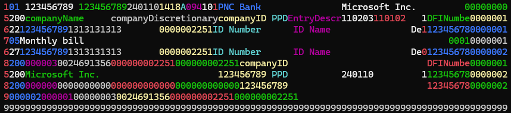

# FastACH
.NET library for reading and writing ACH files

## Continuous integration

| Branch  | Build status |
|---------|--------------|
| master  | [](https://dl.circleci.com/status-badge/redirect/circleci/WCT5H9fXuyQcpJQ1Sfb13U/BoxnGAvKKRXYvq1VrtDyaF/tree/master) |

## Installation [](https://www.nuget.org/packages/FastACH/)

### .NET 7.0
	PM> Install-Package FastACH

Add namespace to the program

``` csharp
using FastACH;
```

## Usage

### Reading ACH file
``` csharp
var achFile = await AchFile.Read("ACH.txt");

achFile.WriteToConsole(); // Output to console
```

``` csharp
// Line map can be used for the error reporting
var lineMap = new List<(IRecord record, uint line)>();
var achFile = await AchFile.Read("ACH.txt", lineMap);
```

### Reading ACH file to colorful console
``` csharp
var achFile = await AchFile.Read(name);
achFile.WriteToConsole();
```



### Writing ACH file
``` csharp
var achFile = new AchFile()
{
    OneRecord = new FileHeaderRecord()
    {
        ImmediateDestination = "123456789",
        ImmediateOrigin = "123456789",
        FileCreationDate = DateOnly.FromDateTime(DateTime.Now),
        FileCreationTime = TimeOnly.FromDateTime(DateTime.Now),
        FileIdModifier = 'A',
        ImmediateDestinationName = "PNC Bank",
        ImmediateOriginName = "Microsoft Inc.",
        ReferenceCode = "00000000"
    },
    BatchRecordList =
    {
        new BatchRecord()
        {
            BatchHeader = new BatchHeaderRecord()
            {
                ServiceClassCode = 200,
                CompanyName = "companyName",
                CompanyDiscretionaryData = "companyDiscretionary",
                CompanyId = "companyID",
                CompanyEntryDescription = "EntryDescr",
                CompanyDescriptiveDate = new DateOnly(2011, 02, 03),
                EffectiveEntryDate = new DateOnly(2011, 01, 02),
                OriginatingDFIID = "DFINumber"
            },
            TransactionDetailsList =
            {
                new TransactionRecord
                {
                    EntryDetail = new EntryDetailRecord()
                    {
                        TransactionCode = 22,
                        ReceivingDFIID = 12345678,
                        CheckDigit = '9',
                        DFIAccountNumber = "1313131313",
                        Amount = 22M,
                        ReceiverIdentificationNumber = "ID Number",
                        ReceiverName = "ID Name",
                        DiscretionaryData = "Desc Data",
                        AddendaRecordIndicator = true,
                    },
                    Addenda = new AddendaRecord()
                    {
                        AddendaInformation = "Monthly bill"
                    }
                },
                new TransactionRecord()
                {
                    EntryDetail = new EntryDetailRecord()
                    {
                        TransactionCode = 27,
                        ReceivingDFIID = 12345678,
                        CheckDigit = '9',
                        DFIAccountNumber = "1313131313",
                        Amount = 27M,
                        ReceiverIdentificationNumber = "ID Number",
                        ReceiverName = "ID Name",
                        DiscretionaryData = "Desc Data",
                        AddendaRecordIndicator = false,
                    },
                    Addenda = null
                }
            }
        }
    }
};

await achFile.WriteToFile("ACH.txt");
```

## Perfomance results

I created a benchmark to compare reading performance between FastACH and very popular [ChoETL.Nacha library](https://github.com/Cinchoo/ChoETL.NACHA).

| Method      | NumberOfEntries | Mean          | Error | Gen0          | Gen1          | Gen2          | Allocated       |
|------------ |---------------- |--------------:|------:|--------------:|--------------:|--------------:|----------------:|
| FastACH     | 1000            |      7.641 ms |    NA |             - |             - |             - |       909.02 KB |
| ChoetlNacha | 1000            |    734.524 ms |    NA |   287000.0000 |   282000.0000 |   282000.0000 |   3764876.44 KB |
| FastACH     | 10000           |     17.351 ms |    NA |             - |             - |             - |      8888.17 KB |
| ChoetlNacha | 10000           |  3,981.774 ms |    NA |  1881000.0000 |  1824000.0000 |  1824000.0000 |  37550128.94 KB |
| FastACH     | 100000          |    148.096 ms |    NA |     7000.0000 |     6000.0000 |     2000.0000 |     88723.47 KB |
| ChoetlNacha | 100000          | 35,719.891 ms |    NA | 21667000.0000 | 21090000.0000 | 21090000.0000 | 375460385.66 KB |